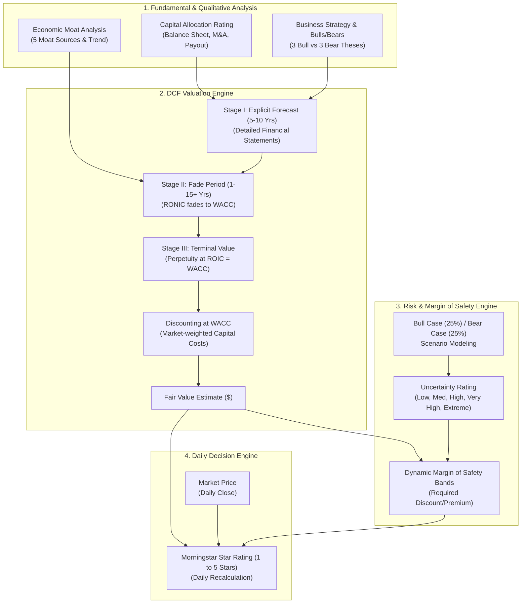

# Morningstar Equity Analyst Report: Comprehensive Report Framework & Chronology

> **Document Analyzed:** `MorningstarEquityAnalystReport.pdf` (19 pages)  
> **Exemplar Company:** Apple Inc. (`AAPL: NASDAQ`)  
> **Lead Sector Strategist:** Abhinav Davuluri, CFA  
> **Methodology Architect:** Morningstar Equity Research Group  

---

## 1. Executive Summary & Framework Architecture

The **Morningstar Equity Analyst Report** is an institutional-grade fundamental equity research document designed to provide long-term, valuation-driven investment guidance. Unlike standard sell-side research that often emphasizes short-term quarterly earnings beats and 12-month price targets, Morningstar’s framework is anchored in **independent, intrinsic value investing**, driven by three foundational tenets:

1. **Economic Moat Analysis:** Assessing the qualitative structural competitive advantages that enable a company to earn returns on invested capital (ROIC) exceeding its weighted average cost of capital (WACC) over 10 to 20+ years.
2. **Three-Stage Discounted Cash Flow (DCF) Modeling:** Projecting long-term cash flows through explicit forecast periods, competitive advantage fade periods, and terminal perpetuity.
3. **Uncertainty & Margin of Safety Star Ratings:** Bounding intrinsic value with bull/bear scenario analyses to assign an Uncertainty Rating, which dynamically dictates the required margin of safety discount for a 5-Star (Buy) or premium for a 1-Star (Sell) recommendation.

### High-Level Document Architecture

The 19-page report is organized into seven distinct structural modules:

```
┌────────────────────────────────────────────────────────────────────────┐
│                      PERSISTENT HEADER & METRIC BAR                    │
│   (Company, Ticker, Star Rating, Price, Fair Value, Moat, Uncertainty) │
├───────────────────────────────────┬────────────────────────────────────┤
│         MODULE 1 (P. 1–2)         │         MODULE 2 (P. 1–8)          │
│   EXECUTIVE SUMMARY & PROFILE     │    DEEP QUALITATIVE DISSECTION     │
│   • Price vs Fair Value Chart     │    • Business Strategy & Outlook   │
│   • Table of Contents             │    • Bulls Say / Bears Say (3x3)   │
│   • Company Business Description  │    • Economic Moat Analysis        │
│   • Sector & Industry Baseline    │    • Fair Value & Profit Drivers   │
│                                   │    • Risk & Uncertainty            │
│                                   │    • Capital Allocation            │
├───────────────────────────────────┴────────────────────────────────────┤
│                       MODULE 3 (P. 3, 13–14)                           │
│                COMPETITIVE BENCHMARKING & PEER MATRIX                  │
│   • Peer Metric Comparison Table (Moat, Valuation, Multiples)          │
│   • Competitors Price vs Fair Value Historical Visuals                 │
├────────────────────────────────────────────────────────────────────────┤
│                        MODULE 4 (P. 8–12)                              │
│                    ANALYST NOTES ARCHIVE                               │
│   • Event-driven chronological notes (Earnings, Product, Macro/Tax)    │
├────────────────────────────────────────────────────────────────────────┤
│                         MODULE 5 (P. 15)                               │
│                FINANCIALS & VALUATION MODEL SUMMARY                    │
│   • 10-Year Historical Financial Summary + YTD + TTM                   │
│   • 3-Year Forward Analyst Historical & Forecast Projections           │
├────────────────────────────────────────────────────────────────────────┤
│                       MODULE 6 (P. 16–17)                              │
│             RESEARCH METHODOLOGY & VALUATION ENGINE                    │
│   • Economic Moat & Moat Trend Definitions                             │
│   • Three-Stage DCF Modeling Mechanics (Stage I, II, III)              │
│   • Uncertainty Tiers & Margin of Safety Table                         │
│   • 1-to-5 Star Rating System Criteria                                 │
├────────────────────────────────────────────────────────────────────────┤
│                       MODULE 7 (P. 18–19)                              │
│             COMPLIANCE, GOVERNANCE & GLOBAL DISCLOSURES                │
│   • Conflicts of Interest, Ownership Policies, Chinese Walls           │
│   • Country-Specific Regulatory Notices (AU, HK, IN, JP, SG)           │
└────────────────────────────────────────────────────────────────────────┘
```

---

## 2. Chronology of Topics & Statements Covered (Pages 1–19)

Below is the chronological breakdown of every section, topic, data point, and analytical statement in the document:

### Page 1: Title, Dashboard, Price vs. Fair Value Chart & Strategy Inception
* **Persistent Top Header Bar:**
  * Document Metadata: Report timestamp (`15 Jul 2021 15:25, UTC`), Reporting Currency (`USD`), Trading Currency (`USD`), Exchange (`NASDAQ`), Page number (`1 of 19`).
  * Company Header: `Apple Inc AAPL`, Current Morningstar Rating (`★★` as of `14 Jul 2021 21:18, UTC`).
  * Core Metric Tiles:
    * **Last Price:** `$149.15 USD` (14 Jul 2021)
    * **Fair Value Estimate:** `$115.00 USD` (29 Apr 2021 02:24, UTC)
    * **Price/FVE:** `1.30` (30% premium / overvalued)
    * **Market Cap:** `2.49 USD Tril` (14 Jul 2021)
    * **Economic Moat™:** `Narrow`
    * **Moat Trend™:** `Stable`
    * **Uncertainty:** `High`
    * **Capital Allocation:** `Standard`
    * **ESG Risk Rating Assessment:** `1 globe / Sustainalytics rating` (7 Jul 2021 05:00, UTC)
* **Price vs. Fair Value Visual Chart (2016 – 2020, YTD):**
  * Graphical comparison plotting closing stock price against the analyst's Fair Value line.
  * Shaded visualization differentiating **Over Valued** (orange) and **Under Valued** (blue) regimes.
  * Tabular Historical Underlay:
    * Historical Price/Fair Value: `2016: 0.87` | `2017: 1.04` | `2018: 0.79` | `2019: 1.33` | `2020: 1.56` | `YTD: 1.30`.
    * Total Return %: `2016: 12.15%` | `2017: 48.24%` | `2018: -5.12%` | `2019: 88.09%` | `2020: 81.85%` | `YTD: 12.73%`.
    * Historical Morningstar Star Rating distribution across time (1 to 5 stars).
* **Left-Hand Metadata Column:**
  * **Contents Table:** Chronological section index linking all subsequent report modules.
  * **Important Disclosure Summary:** Reference to Code of Ethics, equity disclosures URL, statement confirming *the primary analyst covering this company does not own its stock*, and Sustainalytics ESG rating footnote.
* **Latest Note Headline:**
  * *"Apple’s March Quarter Sales Driven to New Highs by Broad-Based Strength, Especially iPhone and Mac"*
* **Business Strategy & Outlook (Abhinav Davuluri, CFA, Sector Strategist, 30 Oct 2020):**
  * *Thesis Statement:* Competitive edge stems from packaging hardware, software, services, and 3rd party applications into sleek, intuitive, premium devices.
  * *Pricing Power vs Peers:* Expertise enables capturing hardware pricing premiums unlike commoditized peers.
  * *Consumer Electronics Risk:* Hardware space is unforgiving to firms that fail to consistently satiate consumer appetites; short product cycles prevent assigning a Wide Moat.
  * *Narrow Moat Drivers:* Supported by switching costs and intangible assets within the iOS walled garden.
  * *iPhone Role:* Foundations of smartphone ecosystem transitioning user habits away from PC computing.

---

### Page 2: Company Profile, Bulls & Bears Say, Moat Deep-Dive
* **Left Sidebar:**
  * **Sector:** Technology | **Industry:** Consumer Electronics.
  * **Business Description:** Comprehensive overview of Apple's device portfolio (iPhone, iPad, Mac, Apple Watch, Apple TV), service ecosystem (Apple Music, iCloud, Apple Care, Apple TV+, Apple Arcade, Apple Card, Apple Pay), proprietary in-house silicon/software stack, distribution channels (online, direct retail, third-party), and geographic exposure (~40% Americas, 60% international).
* **Business Strategy & Outlook (Conclusion):**
  * Customer migration from new smartphone adopters to recurring monetization of existing installed base.
  * Elongating hardware replacement cycles mitigated by high-margin software/services.
  * Role of auxiliary devices (Apple Watch, AirPods) in protecting the "crown jewel" (iPhone).
* **Bulls Say (Abhinav Davuluri, CFA, 28 Apr 2021):**
  1. *Emerging Market & Repeat Sales:* Immense runway from emerging market smartphone adoption paired with high repeat purchase frequency from current users.
  2. *Top-Tier Loyalty & Security:* iPhone and iOS continuously head the pack in customer loyalty, engagement, and security, maximizing long-term retention.
  3. *Continuous Ecosystem Innovation:* Introductions of Apple Pay, Watch, TV, and AirPods generate incremental high-margin revenue and fortify user switching costs.
* **Bears Say (Abhinav Davuluri, CFA, 28 Apr 2021):**
  1. *Premium Pricing Elasticity:* Relentless premium pricing protects gross margins but caps unit growth and locks out price-sensitive consumers.
  2. *Reputational Sensitivity:* Vulnerability to buggy software updates or subpar services eroding Apple’s hallmark "it just works" reputation.
  3. *Artificial Intelligence Deficit:* Perceived lag behind Google and Amazon in AI development (notably Siri voice capabilities), threatening competitiveness in intelligent services.
* **Economic Moat (Abhinav Davuluri, CFA, 29 Oct 2020 - Part 1):**
  * Assignment of **Narrow Economic Moat** derived from **Switching Costs** (primary) and **Intangible Assets** (secondary).
  * Switching costs driven by interconnected auxiliary devices (iPad, Watch, AirPods) and exclusive services (iMessage, FaceTime, Apple Pay).
  * Inconvenience of switching to Android; high barrier to leaving the iOS walled garden.
  * Intangible assets substantiated by proprietary hardware/software co-design, unmatched by tech peers.

---

### Page 3: Competitor Benchmark Matrix & Moat Verification
* **Peer Benchmark Matrix ("Competitors Table"):**
  * Side-by-side comparative analysis of **Apple Inc (AAPL)** vs. **Alphabet Inc Class A (GOOGL)**, **HP Inc (HPQ)**, and **Microsoft Corp (MSFT)** across 19 quantitative and qualitative parameters:
    * *Visual Fair Value vs Last Close bar graphic with uncertainty intervals.*
    * *Economic Moat:* Apple (Narrow), Alphabet (Wide), HP (None), Microsoft (Wide).
    * *Moat Trend:* Apple (Stable), Alphabet (Stable), HP (Negative), Microsoft (Stable).
    * *Fair Value & Date:* AAPL ($115.00), GOOGL ($2,925.00), HPQ ($23.00), MSFT ($278.00).
    * *1-Star / 5-Star Price Thresholds:* Explicit quantitative hurdle prices for buy/sell ratings.
    * *Current Assessment:* AAPL (Over Valued), GOOGL (Under Valued), HPQ (Over Valued), MSFT (Fairly Valued).
    * *Morningstar Rating:* AAPL (★★), GOOGL (★★★★), HPQ (★★), MSFT (★★★).
    * *Analyst Coverage:* Respective sector strategists and senior analysts named.
    * *Capital Allocation Rating:* AAPL (Standard), GOOGL (Standard), HPQ (Standard), MSFT (Exemplary).
    * *Valuation Multiples:* P/FV, P/Sales, P/Book, P/Earnings, Dividend Yield, Market Cap, 52-Week Range, Investment Style (Large Core vs Large Growth vs Mid Value).
* **Economic Moat (Part 2 - Empirical Customer Retention):**
  * Hardware/software integration commanding premium average selling prices (ASPs).
  * Quantitative loyalty proof points:
    * Kantar Dec 2018 survey: 90% of US iPhone owners plan to stay loyal.
    * 451 Research Oct 2020 survey: 98% customer satisfaction score across iPhone 11 series.
  * Loss of auxiliary accessory utility (Watch/AirPods) when paired with non-Apple devices.
  * Android fragmentation preventing coordinated threat to iOS ecosystem.

---

### Page 4: Moat Dissection (Brand Equity & Network Effects Tested)
* **Economic Moat (Part 3):**
  * Smartphone market share vs. profit share: Apple extracts the lion’s share of global smartphone profits despite low-double-digit unit volume share.
  * Failure of peers to replicate integrated hardware-software paradigm (Samsung Tizen OS struggles, Google Pixel niche scale).
  * **Deconstruction of Brand Equity:**
    * *Key Statement:* Brand alone does not constitute an economic moat; brand strength is the *consequence* of differentiated product engineering, not the cause.
    * *Empirical Precedent:* Cites Nokia being ranked the 8th most valuable brand globally in 2010 before collapsing under smartphone disruption.
  * **Why Apple is Narrow, Not Wide:**
    * Active device base reached 1.5 billion (end of 2019).
    * Rapid hardware obsolescence, short product cycles, and unforgiving consumer sentiment.
    * Precedents of fallen tech giants (Nokia, Motorola, BlackBerry).
    * Android OEMs introducing hardware innovations first (OLED displays, 3D sensing).
  * **Deconstruction of Network Effects:**
    * App Store developer dynamics analyzed; developers optimize for iOS due to unified screen sizes and latest OS adoption.
    * Concludes network effect is *not* a primary moat source because Google Play matches the developer flywheel and apps are inherently cross-platform.

---

### Page 5: Cost Advantage Evaluation, Fair Value Drivers & Risk
* **Economic Moat (Part 4 - Supply Chain & Cost Advantage):**
  * Apple’s supply chain purchasing leverage (bulk procurement of memory, flash, foundry capacity).
  * Deemed non-moat because cost advantage relies strictly on massive volume and would vanish if volumes drop; building custom OS is costlier than licensing free Android.
* **Fair Value and Profit Drivers (Abhinav Davuluri, CFA, 28 Apr 2021):**
  * **Intrinsic Valuation Target:** `$115.00 per share` (implied forward GAAP P/E of `22x`).
  * **FY2021 Projections:** Revenue growth expected at `+31% YoY` fueled by 5G iPhone 12 super-cycle and pandemic work/learn-from-home demand for Mac and iPad.
  * **Medium-Term Growth Projections:** Services projected at `11% 5-year CAGR`; Wearables sustaining double-digit growth; post-2021 total revenue growth settling into mid-single digits.
  * **Margin Expectations:**
    * Gross margins modeled in high-30s.
    * Segment gross margin disclosure: Products in low-30s vs. Services hovering near ~65%.
    * Margin tailwinds: Proprietary ARM-based Apple Silicon Macs replacing Intel chips.
    * Operating margins projected in the mid-20s after modeling higher R&D spend.
* **Risk and Uncertainty (Abhinav Davuluri, CFA, 29 Oct 2020 - Part 1):**
  * Massive competitive threats from well-capitalized tech behemoths (Samsung, Google, Microsoft).
  * Cutthroat competition from low-to-mid tier Chinese OEMs (Xiaomi, Oppo, Vivo).

---

### Page 6: Replacement Cycle Headwinds & Capital Allocation Rating
* **Risk and Uncertainty (Part 2):**
  * **Smartphone Saturation & Elongation:** Modern devices are "good enough" for everyday tasks; consumers hold phones longer, risking unit volume stagnation similar to the historical PC market.
  * **Hardware Subsidization by Competitors:** Competitors selling hardware at cost to drive software ecosystems (e.g., Amazon Echo, Fire TV, Kindle Fire).
  * **Voice AI Deficit:** Siri falling behind Amazon Alexa and Google Assistant in voice recognition and contextual AI efficacy.
* **Capital Allocation (Abhinav Davuluri, CFA, 4 Nov 2020 - Part 1):**
  * Overall Stewardship / Capital Allocation Rating: **Standard**.
  * **Leadership & Succession:** Evaluation of Tim Cook’s post-Steve Jobs tenure (COO since 2005, CEO since 2011); Board oversight under Arthur Levinson; COO Jeff Williams identified as lead succession candidate.
  * **Organic Reinvestment & Silicon Strategy:** Praise for in-house semiconductor engineering (A-series Bionic chips, Neural Engine, custom GPU) optimizing OS-hardware synergy.

---

### Page 7: Capital Allocation (Execution, Buybacks, M&A Frugality)
* **Capital Allocation (Part 2):**
  * **Execution History & Missteps:** Analysis of Cook's operational hiccups, including the flawed Apple Maps launch (iOS 6) and the controversial iOS battery throttling / planned obsolescence government probes.
  * **Shareholder Distributions & Capital Structure:**
    * Initiation of dividend and colossal share repurchase program.
    * Authorization of up to `$225 billion` in buybacks (`$168.6 billion` utilized by Sep 2020).
    * Explicit corporate objective to achieve a **net cash neutral** balance sheet over time.
  * **M&A Philosophy:**
    * Frugal, tuck-in M&A approach praised over destructive peer megadeals (contrasted with Microsoft buying Skype, Google buying Motorola/Nest).
    * Beats Music/Electronics acquisition ($3.0B) noted as minor relative to cash balances.
  * **Executive Bench:** Retention and transition of top talent (e.g., Angela Ahrendts transition to Deirdre O'Brien in Retail/People).

---

### Page 8: In-House Silicon Deals & Analyst Notes Archive (Macro Tax & Earnings)
* **Capital Allocation (Part 3):**
  * Evaluation of the July 2019 acquisition of Intel's 5G smartphone modem unit for `$1.0 billion` following settlement with Qualcomm; validates long-term internal silicon roadmap.
* **Analyst Notes Archive (Chronological Stream of Published Event Updates):**
  * **Note 1: Macro Tax Policy Impact (11 May 2021 | Preston Caldwell, Equity Analyst):**
    * *Headline:* "Corporate Tax Hikes Are Very Likely to Come for U.S. Equities"
    * *Context:* Biden's $2T infrastructure plan funded via corporate tax rate increase (proposed 28% from 21%).
    * *Morningstar Probability Model:* 80% chance of tax hike; probability-weighted statutory rate modeled at 26%.
    * *Valuation Impact:* Simulates average US equity valuation decline of `-2.7%` at 26% tax rate, and `-3.8%` decline at 28% tax rate.
  * **Note 2: Q2 FY2021 Earnings Review (29 Apr 2021 | Abhinav Davuluri, CFA):**
    * *Headline:* "Apple’s March Quarter Sales Driven to New Highs by Broad-Based Strength; Raising FVE to $115"
    * *Core Financials:* Q2 revenue ahead of expectations; iPhone sales up +66% YoY to $47.9B on 5G cycle.
    * *Action Taken:* **Fair Value Estimate raised from $98 to $115**; shares deemed overvalued.

---

### Page 9: Analyst Notes Archive (Q2 FY21 Details & Q1 FY21 Record Quarter)
* **Note 2 Continuation (Q2 FY21 Segment Performance):**
  * Segment revenue growth: iPad (+79%), Mac (+70%), Services (+27%), Wearables/Home (+25%).
  * Paid ecosystem subscribers surpass 660 million (up 145M YoY).
  * Greater China revenue surging +88% YoY.
  * Gross margins hit 42.5% (+270 bps QoQ).
  * Supply constraints flagged to impose a $3B–$4B revenue penalty in June quarter.
* **Note 3: Q1 FY2021 Earnings Review (28 Jan 2021 | Abhinav Davuluri, CFA):**
  * *Headline:* "Apple’s iPhone 12 Launch Propels December Quarter Sales to Record Heights; Raising FVE to $98"
  * *Core Financials:* Q1 revenue up +21% YoY to record $65.6B; iPhone up +17%.
  * *Action Taken:* **Fair Value Estimate raised from $85 to $98**; shares deemed overvalued.
  * *Installed Base Update:* Active iPhones cross 1.0 billion; total active Apple devices exceed 1.65 billion; paid subscribers hit 620 million.
  * *Margins:* Gross margin at 39.8% (+160 bps QoQ).

---

### Page 10: Analyst Notes Archive (Q4 FY20 Earnings & iPhone 12 Showcase)
* **Note 3 Continuation:** March quarter outlook and tough services comparisons.
* **Note 4: Q4 FY2020 Earnings Review (30 Oct 2020 | Abhinav Davuluri, CFA):**
  * *Headline:* "Apple’s Mac and iPad Sales Remain Bolstered by Work-From-Home Trend in Q4; Raising FVE to $85"
  * *Core Financials:* Revenue up +1% YoY; iPad (+46%) and Mac (+29%) offset iPhone decline (-21% YoY) caused by delayed iPhone 12 launch.
  * *Action Taken:* **Fair Value Estimate raised from $71 to $85**.
  * *Subscribers:* Paid subscribers reach 585 million; Gross margin at 38.2%.
* **Note 5: Product Event Note (14 Oct 2020 | Abhinav Davuluri, CFA):**
  * *Headline:* "Apple Launches 5G iPhone As Expected; Other Enhancements Relatively Lackluster; No Change to FVE"
  * *Event Analysis:* Oct 13 showcase unveiling 4 models: iPhone 12 ($799), 12 mini ($699), 12 Pro ($999), 12 Pro Max ($1,099). All 5G enabled.
  * *Action Taken:* **Fair Value Estimate maintained at $71**; shares viewed as overvalued.

---

### Page 11: Analyst Notes Archive (Hardware Specs & September Event)
* **Note 5 Continuation:**
  * Technical specs analyzed: A14 Bionic processor (TSMC 5nm EUV), LiDAR autofocus camera scanner on Pro models, 5G cellular throughput expectations.
* **Note 6: September Product Event Note (15 Sep 2020 | Abhinav Davuluri, CFA):**
  * *Headline:* "With New iPhone Delayed Until October, Apple Launches New Watch and iPad at Annual Event"
  * *Event Analysis:* Unveiling of Apple Watch Series 6 ($399, blood oxygen sensor, S6 chip), Apple Watch SE ($279), 8th-gen iPad ($329), iPad Air ($599, A14 Bionic).
  * *Service Bundle Launch:* Introduction of **Apple One** subscription bundle ($14.95 to $29.95/month).
  * *Action Taken:* **Fair Value Estimate maintained at $71**; investors advised to wait for wider margin of safety.

---

### Page 12: Analyst Notes Archive Conclusion
* **Note 6 Continuation:**
  * Technical details on iPad Air USB-C port adoption and price points.
  * Formal conclusion of the Analyst Notes Archive module.

---

### Pages 13–14: Competitor Price vs. Fair Value Comparative Charts
Graphical multi-year valuation trajectories (2016–2020, YTD) providing visual context for peer valuations:
* **Page 13:**
  * **Alphabet Inc Class A (GOOGL):** Price vs Fair Value chart, historical P/FV ratios (0.94 in 2016 to 0.88 YTD), total returns, Morningstar ratings history. Fair Value: `$2,925.00` vs Last Close: `$2,564.74` (**Under Valued**).
  * **HP Inc (HPQ):** Price vs Fair Value chart, historical P/FV ratios (0.93 in 2016 to 1.24 YTD), total returns, Morningstar ratings history. Fair Value: `$23.00` vs Last Close: `$28.59` (**Over Valued**).
* **Page 14:**
  * **Microsoft Corp (MSFT):** Price vs Fair Value chart, historical P/FV ratios (0.99 in 2016 to 1.02 YTD), total returns, Morningstar ratings history. Fair Value: `$278.00` vs Last Close: `$282.51` (**Fairly Valued**).

---

### Page 15: Quantitative Financial Statements & Forecast Model Summary
Comprehensive standardized financial data divided into two major tables:

#### Table 1: Morningstar Historical Summary (as of 31 Mar 2021)
Covers a **10-year historical trajectory (FY2011–FY2020) + YTD + Trailing Twelve Months (TTM)** across four categories:
1. **Financials:**
   * Revenue ($ Bil) & Revenue Growth %
   * EBITDA ($ Bil) & EBITDA Margin %
   * Operating Income ($ Bil) & Operating Margin %
   * Net Income ($ Bil) & Net Margin %
   * Diluted Shares Outstanding (Bil)
   * Diluted Earnings Per Share (USD)
   * Dividends Per Share (USD)
2. **Valuation (as of 30 Jun 2021):**
   * Price/Sales, Price/Earnings, Price/Cash Flow, Dividend Yield %, Price/Book, EV/EBITDA.
3. **Operating Performance / Profitability (as of 31 Mar 2021):**
   * Return on Assets (ROA %)
   * Return on Equity (ROE %)
   * Return on Invested Capital (ROIC %)
   * Asset Turnover Ratio
4. **Financial Leverage (as of 31 Mar 2021):**
   * Debt/Capital %
   * Equity/Assets %
   * Total Debt / EBITDA
   * EBITDA / Interest Expense coverage

#### Table 2: Morningstar Analyst Historical / Forecast Summary (as of 28 Apr 2021)
Presents the analyst's explicit forecast model linking historical baseline years (2019, 2020) to three projected fiscal years (**2021E, 2022E, 2023E**):
* **Financial Forecasts:** Revenue, Growth %, EBITDA, EBITDA Margin %, Operating Income, Operating Margin %, Net Income, Net Margin %, Diluted Shares, EPS, DPS.
* **Forward Valuation Estimates:** Forward P/S, forward P/E, forward P/CF, forward Dividend Yield, forward P/B, forward EV/EBITDA multiples.

---

### Page 16: Research Methodology & Valuation Engine (Moat & 3-Stage DCF)
* **Methodology Overview:** Intrinsic valuation based on discounted future cash flows using standardized, global DCF templates augmented by scenario analysis and multiples cross-checks.
* **The 4 Rating Drivers:** (1) Economic Moat, (2) Fair Value Estimate, (3) Uncertainty around Fair Value, (4) Market Price.
* **Pillar 1: Economic Moat Framework:**
  * Definition of economic profits: $\text{ROIC} > \text{WACC}$.
  * **The 5 Moat Sources:** Intangible Assets, Switching Costs, Network Effect, Cost Advantage, Efficient Scale.
  * **Moat Width Horizons:**
    * *None:* Normalized excess returns rapidly gravitate to cost of capital.
    * *Narrow:* High probability of excess returns lasting at least 10 years.
    * *Wide:* High confidence of excess returns lasting 10+ years, and more likely than not for 20+ years.
  * **Value Destruction Screen:** Excludes firms vulnerable to cumulative or mid-cycle capital destruction from ESG risks, industry disruption, or financial distress.
  * **Moat Trend:** Positive (widening), Stable, or Negative (eroding).
* **Pillar 2: Three-Stage DCF Model:**
  * **Stage I (Explicit Forecast, 5–10 Years):** Detailed financial statement projections (revenue, margins, capex, working capital) calculating Earnings Before Interest after Taxes (EBI) and Net New Investment (NNI) to derive Free Cash Flow to the Firm (FCFF).
  * **Stage II (Fade Period, 1–15+ Years):** Period during which Return on New Invested Capital (RONIC) fades down to WACC. Length depends on moat strength. Modeled via 4 variables: average EBI growth, normalized investment rate, RONIC, and years to perpetuity.
  * **Stage III (Perpetuity):** Marginal $\text{ROIC} = \text{WACC}$; standard perpetuity formula assuming zero economic value creation or destruction.
  * **Discount Rate:** Cash flows discounted at WACC using expected long-term proportionate market-value debt/equity weights.
* **Methodology Diagram:** Visual flowchart linking Fundamental Analysis $\rightarrow$ Valuation $\rightarrow$ Margin of Safety $\rightarrow$ Morningstar Star Rating.

---

### Page 17: Uncertainty Rating, Margin of Safety & Star Rating Definition
* **Pillar 3: Uncertainty Around Fair Value Estimate:**
  * Bounding intrinsic value using probabilistic scenario modeling:
    * **Bull Case:** Analyst models 25% probability of outperformance.
    * **Bear Case:** Analyst models 25% probability of underperformance.
    * Spread between bull and bear cases determines the Uncertainty tier.
  * **The 5 Uncertainty Tiers & Margin of Safety Table:**

| Uncertainty Rating | 5-Star Discount (Required Margin of Safety) | 1-Star Premium (Overvaluation Hurdle) |
| :--- | :---: | :---: |
| **Low** | 20% Discount | 25% Premium |
| **Medium** | 30% Discount | 35% Premium |
| **High** | 40% Discount | 55% Premium |
| **Very High** | 50% Discount | 75% Premium |
| **Extreme** | 75% Discount | 300% Premium |

* **Visual Distribution Chart:** Morningstar Equity Research Star Rating Methodology showing Price/Fair Value cutoffs across uncertainty bands.
* **Pillar 4: Market Price & Daily Automatic Recalculation:**
  * Star rating is recalculated daily at market close using live exchange closing prices.
  * No predefined distribution (percentage of 5-star stocks fluctuates with market-wide valuation).
  * Base assumption: Market price converges to Fair Value Estimate within 3 years.
* **Formal Morningstar Star Rating Definitions:**
  * **★★★★★ (5 Stars):** Extreme risk-adjusted discount. Significantly undervalued; highly likely to appreciate beyond fair risk-adjusted returns over multi-year horizon.
  * **★★★★ (4 Stars):** Appreciation beyond fair risk-adjusted return is likely.
  * **★★★ (3 Stars):** Fairly valued; investor likely to receive fair risk-adjusted return (approximately cost of equity).
  * **★★ (2 Stars):** Overvalued; investor likely to receive less than fair risk-adjusted return.
  * **★ (1 Star):** Extreme risk of capital loss. Excessively optimistic market pricing; high probability of undesirable risk-adjusted returns.
* **Other Terminology:**
  * **Last Price:** Close price of last trading day.
  * **Capital Allocation Rating:** Evaluation of management quality across Balance Sheet Health, Investment Strategy/M&A, and Shareholder Distributions (Exemplary, Standard, Poor).

---

### Pages 18–19: Compliance, Governance & Global Jurisdictional Disclosures
* **Page 18:**
  * **Historical Note:** Explains change in Capital Allocation methodology enacted on Dec 9, 2020.
  * **Risk Warning:** Standard warning regarding principal loss, past performance limitations, and uncertainty sensitivity.
  * **General Disclosure:** Non-personalized investment advice disclaimer; requirement for institutional investors to exercise independent judgment.
  * **Conflicts of Interest Policy:**
    * Analyst security ownership prohibition.
    * Morningstar Inc. corporate ownership threshold disclosure (>0.5% share capital).
    * Analyst compensation independent of investment banking/commissions.
    * Prohibition of market making or underwriting activities.
    * Strict Chinese walls between Equity Research Group and Morningstar Investment Management.
    * Public company ownership disclosure for `MORN` (Nasdaq).
    * Adherence to CFA Institute Code of Ethics and Standards of Professional Conduct.
  * **Regional Notice:** Australia (Morningstar Australasia Pty Ltd, AFSL 240892).
* **Page 19:**
  * **Hong Kong:** Morningstar Investment Management Asia Limited (regulated by SFC).
  * **India:** Morningstar Investment Adviser India Private Limited (SEBI Reg INA000001357), Research Analyst regulations, associate company disclosures.
  * **Japan:** Ibbotson Associates Japan, Inc. (regulated by Financial Services Agency).
  * **Singapore:** Institutional investor exemptions under Section 32B and 32C of Financial Advisers Regulations.

---

## 3. Core Analytical Frameworks & Methodologies

The Morningstar report framework consists of six interconnected analytical engines:



---

### Framework 1: The Economic Moat Framework

Morningstar defines an economic moat as the structural ability of a firm to generate normalized returns on invested capital ($\text{ROIC}$) exceeding its weighted average cost of capital ($\text{WACC}$) for an extended period.

```
       ROIC > WACC
┌────────────────────────┐
│  Wide Moat (20+ Years) │
└───────────┬────────────┘
            │
┌───────────▼────────────┐
│ Narrow Moat (10+ Years)│
└───────────┬────────────┘
            │
┌───────────▼────────────┐
│   No Moat (0–10 Years) │
└────────────────────────┘
```

#### The Five Moat Sources
1. **Switching Costs:** Economic, operational, or psychological costs making it prohibitive for customers to switch to a rival (e.g., Apple iOS ecosystem, accessories lock-in, data integration).
2. **Intangible Assets:** Patents, regulatory licenses, brand recognition, or proprietary engineering that enables price premiums or volume protection (e.g., Apple's hardware-software co-design).
   * *Critical Rule:* Brand alone is **not** a moat unless it demonstrably drives pricing power or customer loyalty independent of product superiority (e.g., Nokia precedent).
3. **Network Effects:** The value of a product or service increases as more users adopt it (e.g., App Store developer ecosystem).
4. **Cost Advantages:** Structural advantages in procurement, scale, distribution, or manufacturing allowing a firm to produce at structurally lower costs than peers.
5. **Efficient Scale:** A specialized market size where incumbent capacity satisfies demand, making entry unprofitable for newcomers.

#### Moat Trend
* **Positive:** Competitive advantage is actively strengthening.
* **Stable:** Competitive advantage is durable and unchanging over the multi-year horizon.
* **Negative:** Fundamentals, technology, or substitute products are eroding the moat.

#### Value Destruction Filter
A company cannot possess an economic moat if it faces a material probability of catastrophic mid-cycle capital destruction from ESG liabilities, technological disruption, or solvency risks.

---

### Framework 2: The Three-Stage DCF Valuation Engine

Fair Value is determined via Free Cash Flow to the Firm (FCFF) discounted at the Weighted Average Cost of Capital (WACC):

$$\text{Fair Value} = \sum_{t=1}^{N_1} \frac{\text{FCFF}_t}{(1 + \text{WACC})^t} + \sum_{t=N_1+1}^{N_2} \frac{\text{FCFF}_t}{(1 + \text{WACC})^t} + \frac{\text{Continuing Value}_{N_2}}{(1 + \text{WACC})^{N_2}}$$

#### Stage I: Explicit Forecast Period (Years 1 to 5–10)
* Detailed bottom-up modeling of Income Statement, Balance Sheet, and Capital Expenditure.
* Calculation of Earnings Before Interest after Taxes ($\text{EBI}$) and Net New Investment ($\text{NNI}$):
  $$\text{FCFF} = \text{EBI} - \text{NNI} = \text{EBIT} \times (1 - \text{Tax Rate}) + \text{D&A} - \text{CapEx} - \Delta\text{NWC}$$

#### Stage II: Competitive Advantage Fade Period (Years 5/10 to 15/20+)
* Models the economic reality that competition eventually erodes excess profitability.
* Return on New Invested Capital ($\text{RONIC}$) fades down toward $\text{WACC}$.
* The length of this stage is directly dictated by the **Economic Moat**:
  * *No Moat:* 1 to 5 years fade.
  * *Narrow Moat:* 5 to 10 years fade.
  * *Wide Moat:* 10 to 15+ years fade.
* Cash flows modeled algorithmically based on average EBI growth, normalized reinvestment rate, and RONIC path.

#### Stage III: Perpetuity / Continuing Value
* Once marginal $\text{RONIC} = \text{WACC}$, incremental capital investment neither creates nor destroys shareholder value.
* Continuing value calculated via standardized perpetuity formula.

---

### Framework 3: Uncertainty Rating & Margin of Safety Star Matrix

Valuation is inherently uncertain; therefore, Morningstar links risk directly to the **required discount** before issuing a Buy recommendation.

1. **Scenario Generation:**
   * Base Case (Expected scenario)
   * Bull Case (25% probability of exceeding)
   * Bear Case (25% probability of underperforming)
2. **Uncertainty Classification:**
   The spread between Bull and Bear valuations defines the Uncertainty tier (**Low, Medium, High, Very High, Extreme**).
3. **Dynamic Star Rating Cutoffs:**

```
Price / Fair Value Ratio
     ▲
     │  [1-STAR: SEVERELY OVERVALUED]
1.55 ┼──────────────────────────────────── (High Uncertainty 1-Star Cutoff: +55%)
     │  [2-STAR: OVERVALUED]
1.00 ┼──────────────────────────────────── (Fair Value Estimate: 1.00)
     │  [3-STAR: FAIRLY VALUED]
     │
0.60 ┼──────────────────────────────────── (High Uncertainty 5-Star Cutoff: -40%)
     │  [4-STAR: UNDERVALUED]
     │  [5-STAR: SEVERELY UNDERVALUED]
     ▼
```

* *Apple Case Study in Document:*
  * Uncertainty: **High**
  * Required 5-Star Discount: **40%** (5-Star Price $\le \$69.00$)
  * Required 1-Star Premium: **55%** (1-Star Price $\ge \$178.25$)
  * Fair Value: **$115.00** | Market Price: **$149.15** | Price/FVE: **1.30**
  * Outcome: **2 Stars (★★)** (Overvalued; expected return below cost of equity).

---

### Framework 4: Capital Allocation (Stewardship) Framework

Evaluates management's efficacy across three distinct operational levers on a forward-looking basis:

1. **Balance Sheet Health:** Financial leverage, debt maturity profile, liquidity, cyclical debt sensitivity.
2. **Investment Strategy & Execution:** Organic reinvestment (R&D, CapEx), discipline in mergers and acquisitions (avoiding value-destroying megadeals vs value-accretive tuck-in deals), strategic focus.
3. **Shareholder Distributions:** Prudence of dividends and share buybacks (timing buybacks when shares trade at discounts vs executing price-insensitive repurchases).
* **Ratings Assigned:**
  * **Exemplary:** Exceptional stewardship adding demonstrable shareholder value.
  * **Standard:** Disciplined, appropriate stewardship with no major capital allocation flaws.
  * **Poor:** History of value destruction, reckless M&A, weak balance sheet governance.

---

### Framework 5: Bulls Say / Bears Say Dialectic

A balanced synthesis designed to prevent analyst confirmation bias:
* **Format:** Exactly **3 Bulls Say** bullet points vs. exactly **3 Bears Say** bullet points.
* **Analytical Standard:**
  * Bulls focus on expansion catalysts, competitive barriers, and monetization runway.
  * Bears focus on margin compression, execution vulnerabilities, technological disruption, and valuation limits.

---

### Framework 6: Event-Driven Analyst Notes Archive

Captures the real-time operational evolution of the company and model updates:
* **Cadence:** Triggered by quarterly earnings calls, product launches, material M&A, regulatory events, or macroeconomic shifts.
* **Structure of Each Note:**
  1. *Actionable Headline with FVE Action:* (e.g., "...Raising FVE to $115").
  2. *Lead Byline & Date:* Author name, title, and release date.
  3. *Core Results vs Expectations:* Performance against internal model.
  4. *Segmental Breakdown:* Granular unit and revenue changes.
  5. *Model Adjustments & Valuation Verdict:* Clear statement of new Fair Value Estimate and Star Rating implication.

---

## 4. Replication Guide: Generating Research under the Morningstar Standard

To construct a new institutional equity research report adhering strictly to this Morningstar framework, follow this step-by-step workflow:

### Step 1: Establish Persistent Header & Metadata
* Identify Company, Ticker, Exchange, Reporting Currency.
* Capture Last Close Price and Market Cap.
* Determine Economic Moat (`Wide`, `Narrow`, `None`), Moat Trend (`Positive`, `Stable`, `Negative`), Uncertainty (`Low`, `Medium`, `High`, `Very High`, `Extreme`), and Capital Allocation (`Exemplary`, `Standard`, `Poor`).
* Integrate ESG Risk Rating score from Sustainalytics.

### Step 2: Build the Core Qualitative Narrative
* **Business Strategy & Outlook:** Analyze the firm's competitive differentiation, core products, customer retention mechanics, and multi-year industry posture.
* **Bulls Say / Bears Say:** Draft exactly 3 thesis-driven bull arguments and 3 structural bear concerns.
* **Economic Moat Dissection:**
  * Evaluate each of the 5 sources systematically (Switching Costs, Intangibles, Network Effects, Cost Advantage, Efficient Scale).
  * Substantiate claims with empirical customer retention or pricing data.
  * Explicitly justify why the moat is *Narrow* rather than *Wide* (or vice versa).
* **Fair Value & Profit Drivers:** Explain key revenue CAGRs, segment gross margins, R&D/operating expense trajectory, and implied valuation multiples.
* **Risk & Uncertainty:** Outline competitive dynamics, replacement cycle risks, technological threats, and macro exposure.
* **Capital Allocation:** Audit executive leadership, organic R&D, M&A history, buybacks, and dividend safety.

### Step 3: Execute Valuation & Set Star Rating Cutoffs
* Run Stage I DCF (5–10 years explicit modeling) to derive FCFF.
* Apply Stage II fade parameters matching the assigned Economic Moat.
* Discount cash flows using WACC to establish the **Fair Value Estimate**.
* Model 25% probability Bull and Bear cases to assign the **Uncertainty Rating**.
* Look up required Margin of Safety thresholds to calculate 5-Star and 1-Star trigger prices.
* Compare current market price to Fair Value to assign the **1-to-5 Star Rating**.

### Step 4: Populate Peer Matrix & Financial Schedules
* Benchmarking against 3 direct competitors across Moat, Valuation, and Multiples.
* Build the 10-Year Historical Summary table across Financials, Valuation, Operating Performance, and Financial Leverage.
* Provide 3-year forward explicit projections (Revenue, EBITDA, Operating Income, Net Income, EPS, Multiples).

### Step 5: Append Event Notes & Global Disclosures
* Include historical analyst update notes documenting major earnings releases and model revisions.
* Append mandatory compliance notices, analyst ownership disclaimers, and international regulatory distribution disclosures.

---

## 5. Report Framework Summary Reference Card

| Framework Component | Location in Report | Primary Purpose | Update Frequency |
| :--- | :--- | :--- | :--- |
| **Top Metric Bar** | Top of Every Page (P. 1–19) | Instant at-a-glance rating and valuation dashboard | Daily (Price/Stars) / Event-driven (FVE) |
| **Price vs Fair Value Chart** | Page 1 | Visual historical over/undervaluation track record | Daily / Quarterly |
| **Company Business Profile** | Page 2 (Sidebar) | Core operations, segments, distribution, geographies | Annual / As business shifts |
| **Bulls Say / Bears Say** | Page 2 | Balanced 3v3 investment thesis dialectic | Quarterly / Major catalyst |
| **Economic Moat Analysis** | Pages 2–5 | Structural competitive advantage deep-dive | Semi-Annual / Annual |
| **Peer Comparison Table** | Page 3 | Direct relative valuation and competitive benchmarking | Daily (Prices) / Quarterly (Models) |
| **Fair Value & Profit Drivers** | Page 5 | Operational growth, margins, and DCF drivers | Quarterly / After earnings |
| **Risk & Uncertainty** | Pages 5–6 | Structural headwinds, substitution risks, tech threats | Semi-Annual / Annual |
| **Capital Allocation** | Pages 6–8 | Management stewardship, M&A, balance sheet, buybacks | Annual / Management changes |
| **Analyst Notes Archive** | Pages 8–12 | Reverse-chronological event and earnings notes | Event-driven (earnings, launches) |
| **Peer Visual Charts** | Pages 13–14 | Multi-year historical P/FV graphs for peer cohort | Daily / Quarterly |
| **Financial Statements Table** | Page 15 | 10-year historical + 3-year forward financial summary | Quarterly / Model revisions |
| **Research Methodology** | Pages 16–17 | Theoretical foundation: Moats, 3-Stage DCF, Star Bands | Static institutional standard |
| **Compliance Disclosures** | Pages 18–19 | Legal independence, conflicts of interest, global rules | Static regulatory standard |
